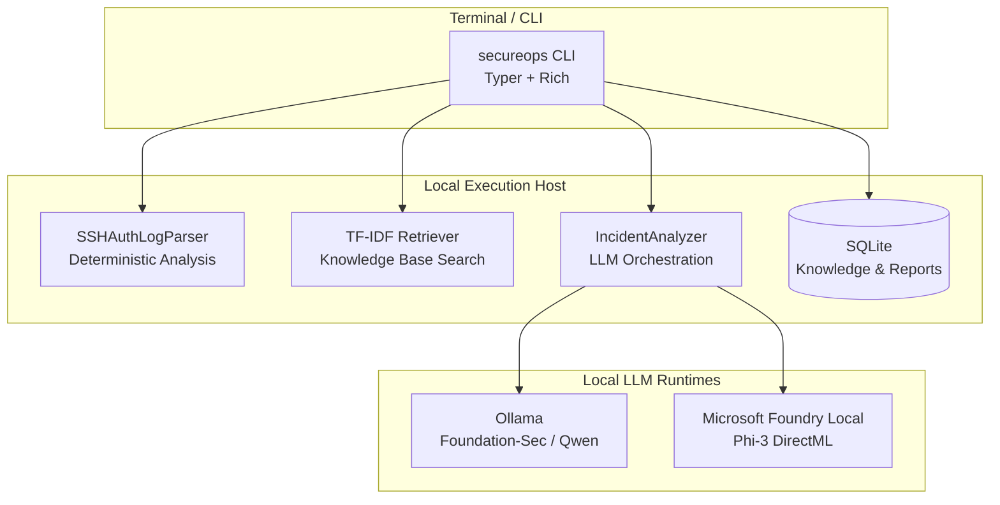

# SecureOps Local

<div align="center">
  <p><strong>Air-gapped incident-review decision-support system for Linux SSH authentication logs, powered by local LLM inference, deterministic parsing, and document-grounded RAG.</strong></p>

  [](https://www.python.org/downloads/)
  [](https://typer.tiangolo.com)
  [](https://fastapi.tiangolo.com)
  [](https://docs.pydantic.dev)
  [](https://www.sqlite.org)
  [](#data-provenance-and-licensing)
</div>

---

## 📖 Table of Contents

- [Overview](#-overview)
- [Command Line Interface (CLI)](#-command-line-interface-cli)
  - [CLI Overview](#cli-overview)
  - [Knowledge Base Commands](#knowledge-base-commands)
  - [Incident Analysis Command](#incident-analysis-command)
  - [CLI Usage Examples](#cli-usage-examples)
- [Why SecureOps Local?](#-why-secureops-local)
- [Architecture & Pipeline](#-architecture--pipeline)
  - [System Topology](#system-topology)
  - [Analysis Pipeline](#analysis-pipeline)
  - [Deterministic AI Guarantee](#deterministic-ai-guarantee)
- [Core Components](#-core-components)
- [Model Candidates & Profiles](#-model-candidates--profiles)
- [Getting Started](#-getting-started)
  - [Prerequisites](#prerequisites)
  - [Installation & Setup](#installation--setup)
  - [Running the CLI & API](#running-the-cli--api)
- [API Reference](#-api-reference)
- [Project Status](#-project-status)
- [Security & Privacy](#-security--privacy)

---

## 🌟 Overview

SecureOps Local is a **local-first, air-gapped-ready** tool that turns raw SSH authentication logs into structured, cited incident-review reports — without sending a single byte to a cloud service.

Built specifically for **SOC analysts and system administrators**, SecureOps Local follows the Unix philosophy and provides a native Python CLI with rich terminal formatting (tables, status indicators, and color-coded risk levels).

### Who is this for?

| Audience | Use Case |
|---|---|
| **SOC analysts** | Rapid terminal-based triage, evidence aggregation, and defensive guidance |
| **System administrators** | Quick SSH log review on servers without spinning up web GUIs |
| **Security engineers** | Repeatable, auditable incident analysis grounded in local knowledge bases |
| **Privacy-conscious teams** | Air-gapped incident review on isolated air-gapped networks |

### Scope

✅ **What it is:** A log-summarization tool, document-grounded decision-support CLI, and local deployment-profile evaluation platform.  
❌ **What it is NOT:** A SIEM, IDS/IPS, antivirus, automated remediation system, or an automated attack blocker.

---

## 🖥️ Command Line Interface (CLI)

SecureOps Local includes a full-featured terminal CLI powered by `typer` and `rich`. The CLI interacts directly with the internal deterministic core, RAG engine, and local LLM runtime without requiring a web browser or server.

### CLI Overview

```bash
# View help and all available commands
python -m src.cli.main --help

# Check version
python -m src.cli.main version
```

### Knowledge Base Commands

Manage local security guidance documents (NIST, CISA, MITRE ATT&CK, OWASP, etc.) stored in SQLite for RAG retrieval:

```bash
# Ingest a security guide (PDF, Markdown, or Plaintext)
python -m src.cli.main knowledge add /path/to/NIST_SP_800-61r3.pdf
python -m src.cli.main knowledge add docs/context/RAG_AND_KNOWLEDGE_BASE.md

# List all currently indexed knowledge base documents
python -m src.cli.main knowledge list
```

Example `knowledge list` output:
```text
                  Indexed Knowledge Base Documents (2 total)                   
┌──────────────────┬──────────────────────────┬──────┬───────┬────────┬─────────────────────┐
│ Doc ID           │ Filename                 │ Form │ Chunks│ Size   │ SHA-256 Digest      │
├──────────────────┼──────────────────────────┼──────┼───────┼────────┼─────────────────────┤
│ doc_532d61ffbd95 │ OFFLINE_WORKFLOW.md      │  MD  │     7 │ 2.9 KB │ 532d61ff...a33fb8c4 │
│ doc_69677c8a6346 │ RAG_AND_KNOWLEDGE_BASE.md│  MD  │    18 │ 6.7 KB │ 69677c8a...50c391cb │
└──────────────────┴──────────────────────────┴──────┴───────┴────────┴─────────────────────┘
```

### Incident Analysis Command

Analyze an SSH authentication log file (`.log` or `.txt`), aggregate deterministic facts, retrieve relevant security literature, and generate a cautious risk assessment:

```bash
# Basic analysis using the default profile (foundation-sec-8b-reasoning:q4_k_m on Ollama)
python -m src.cli.main analyze examples/demo_ssh_logs.log

# Specify a custom model profile and export structured JSON
python -m src.cli.main analyze /var/log/auth.log \
    --model foundation-sec-8b-reasoning:q4_k_m \
    --provider ollama \
    --output-json report.json

# Using Microsoft Foundry Local runtime
python -m src.cli.main analyze /var/log/auth.log \
    --model Phi-3-mini-4k-instruct-onnx \
    --provider foundry \
    --base-url http://localhost:39251
```

### CLI Output Preview

When running `secureops analyze`, the terminal displays:
1. **Deterministic Facts (Parser Truth):** A structured summary of IP addresses, failed/successful login counts, targeted user accounts, and timestamps.
2. **Cautious AI Incident Assessment:** Risk level (`HIGH`, `MEDIUM`, `LOW`), evidence-based interpretations, risk reasoning, and non-destructive defensive recommendations.
3. **Citations:** Every claim linked back to audited knowledge chunks.

---

## 🎯 Why SecureOps Local?

Pasting raw security logs into public cloud AI services violates privacy, leaks credentials, and suffers from hallucinations. SecureOps Local solves this through four core pillars:

1. **Deterministic Constraints:** A strict Python parser computes all mathematical facts (counts, IPs, timestamps). The LLM is strictly prohibited from inventing parser numbers.
2. **Air-Gapped Privacy:** Zero cloud LLM fallback. All model inference and RAG search execute locally on host hardware.
3. **Document-Grounded RAG:** The LLM reasons only over retrieved chunks from audited security literature.
4. **Strict Structured Output:** Responses must strictly conform to the `ModelAssessment` JSON schema. Reasoning traces (`<think>`) are scrubbed before presentation.

---

## 🏗️ Architecture & Pipeline

### System Topology



### Deterministic AI Guarantee

SecureOps Local enforces a strict trust boundary between deterministic truth and model interpretation:
- **Trusted (Parser):** IP addresses, event counts, success/failure rates, timestamp ranges, auth methods, invalid-user flags.
- **Constrained (Model):** Summary of observed patterns, risk level (low/medium/high), evidence-based reasoning, defensive recommendations.

---

## 🧩 Core Components

### 1. SSH Authentication Log Parser
- **Formats:** Syslog (`Aug 10 14:12:05`) and ISO 8601 / journald.
- **Events:** `successful_login`, `failed_login`, `invalid_user`, `connection_closed`, etc.
- **Aggregation:** Detects repeated failures, password guessing, and account targeting.

### 2. Local Knowledge Base & RAG
- **Ingestion:** Supports PDF, Markdown, and TXT with heading-aware chunking.
- **Retrieval:** Pure-Python TF-IDF + cosine similarity (deterministic, no external vector DB).
- **Citation Guarantee:** Every model citation is programmatically validated against retrieved chunks.

### 3. Provider-Independent LLM Pipeline
- **Adapters:** Supports Ollama (`/api/chat`) and Foundry Local (`/v1/chat/completions`).
- **Privacy:** Reasoning traces (`<think>` blocks) from models like Foundation-Sec are stripped via regex and **never persisted or printed**.

---

## 🧠 Model Candidates & Profiles

| Profile | Runtime | Model | Quantization | Role |
|---|---|---|---|---|
| **Foundation-Sec** | Ollama | `foundation-sec-8b-reasoning:q4_k_m` | Q4_K_M (GGUF) | Domain-specialized cybersecurity candidate (Default) |
| **Qwen** | Ollama | `qwen:0.5b` / `qwen3.5:9b` | Q4_K_M | Fast baseline reference |
| **Foundry** | Foundry Local | `Phi-3-mini-4k-instruct-onnx` | ONNX INT4 | Hardware-accelerated Windows candidate |

---

## 🚀 Getting Started

### Prerequisites

- **Python** 3.12+
- **Ollama** 0.32+ (For Foundation-Sec and Qwen)
- **Foundry Local** 0.10+ (Optional, for Microsoft model inference)

### Installation & Setup

1. **Clone the repository:**
   ```bash
   git clone https://github.com/husoelrey/SecureOpsLocal.git
   cd SecureOpsLocal
   ```

2. **Setup virtual environment:**
   ```bash
   python -m venv .venv
   .venv\Scripts\activate  # Windows
   # or: source .venv/bin/activate  # Linux/macOS
   ```

3. **Install dependencies:**
   ```bash
   pip install --upgrade pip
   pip install -r requirements.txt
   ```

4. **Prepare Local Models (Ollama):**
   ```bash
   ollama pull qwen:0.5b
   # Or create the Foundation-Sec profile using your local GGUF
   ollama create foundation-sec-8b-reasoning:q4_k_m -f Modelfile
   ```

### Running the CLI & API

```bash
# 1. Run the CLI directly
python -m src.cli.main version
python -m src.cli.main analyze examples/demo_ssh_logs.log

# Or using the wrapper script:
./secureops.bat analyze examples/demo_ssh_logs.log  # Windows
./secureops analyze examples/demo_ssh_logs.log      # Linux / WSL

# 2. Alternatively, start the FastAPI server for Swagger UI
uvicorn src.main:app --host 127.0.0.1 --port 8000 --reload
```

---

## 📊 Project Status

| Phase | Description | Status |
|---|---|---|
| **P0** | Repository governance and project context | ✅ Complete |
| **P1** | Local runtime and model profiles | ✅ Complete |
| **P2** | Deterministic SSH analysis core | ✅ Complete |
| **P3** | Local knowledge base and RAG | ✅ Complete |
| **P4** | Provider-independent incident analysis | ✅ Complete |
| **P5** | API, persistence, and job orchestration | ✅ Complete |
| **P6** | Deployment-profile benchmark & selection | ✅ Complete |
| **P7** | Offline and GitHub readiness | ✅ Complete |
| **CLI**| Native Typer & Rich Command Line Interface | ✅ Complete |

---

## 🔒 Security & Privacy

SecureOps Local processes sensitive security data and is built with strict privacy guarantees:

- **No Cloud Fallback:** Data never leaves the local machine.
- **No Raw Log Persistence:** Only hashes, sizes, and structured metadata are stored in SQLite.
- **Privacy-Minimized Retrieval:** IP addresses and usernames are scrubbed from search queries.
- **Defensive Boundary:** The application does **not** execute commands, block addresses, or modify firewall rules. Recommendations are limited to investigation and hardening.

---
*For more detailed documentation, please refer to the `docs/context/` directory.*
