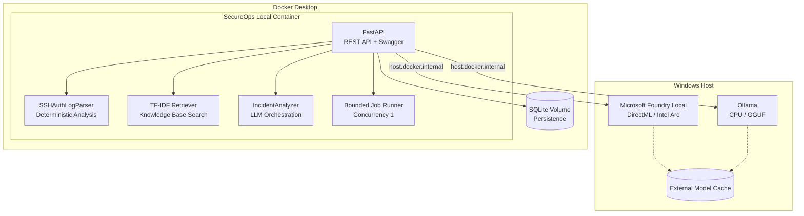
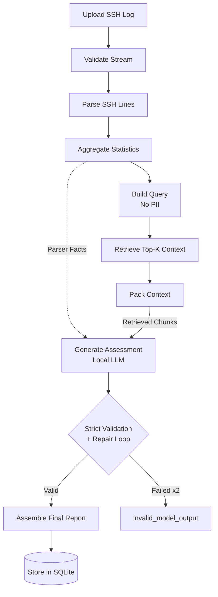

# SecureOps Local

<div align="center">
  <p><strong>Air-gapped incident-review decision-support system for Linux SSH authentication logs, powered by local LLM inference, deterministic parsing, and document-grounded RAG.</strong></p>

  [](https://www.python.org/downloads/)
  [](https://fastapi.tiangolo.com)
  [](https://docs.pydantic.dev)
  [](https://www.sqlite.org)
  [](#data-provenance-and-licensing)
</div>

---

## 📖 Table of Contents

- [Overview](#-overview)
- [Why SecureOps Local?](#-why-secureops-local)
- [Architecture & Pipeline](#-architecture--pipeline)
  - [System Topology](#system-topology)
  - [Analysis Pipeline](#analysis-pipeline)
  - [Deterministic AI Guarantee](#deterministic-ai-guarantee)
- [Core Components](#-core-components)
- [Model Candidates & Profiles](#-model-candidates--profiles)
- [Getting Started](#-getting-started)
  - [Prerequisites](#prerequisites)
  - [Installation & Setup](#installation--setup)
  - [Running the Application](#running-the-application)
- [API Reference](#-api-reference)
- [Project Status](#-project-status)
- [Security & Privacy](#-security--privacy)

---

## 🌟 Overview

SecureOps Local is a **local-first, air-gapped-ready** prototype that turns raw SSH authentication logs into structured, cited incident-review reports — without sending a single byte to a cloud service.

### Who is this for?

| Audience | Use Case |
|---|---|
| **Junior SOC analysts** | Repeatable, evidence-based first-pass incident review |
| **System administrators** | Structured SSH log triage with defensive recommendations |
| **Security students** | Hands-on study of deterministic parsing, RAG, and local inference |
| **Small technical teams** | Privacy-preserving incident assessment on private infrastructure |
| **AI engineers** | Reference implementation for constrained local LLM pipelines |

### Scope

✅ **What it is:** A log-summarization tool, document-grounded decision-support prototype, and local deployment-profile evaluation platform.
❌ **What it is NOT:** A SIEM, IDS/IPS, antivirus, automated remediation system, or a source of guaranteed attack attribution.

---

## 🎯 Why SecureOps Local?

Pasting raw logs into a cloud AI violates data privacy, risks exfiltration, and suffers from hallucinations (inventing IP addresses, miscounting events, fabricating timelines). SecureOps Local solves this through four pillars:

1. **Deterministic Constraints:** A strict Python parser extracts all mathematical truth. The LLM is forbidden from computing counts, addresses, or timestamps.
2. **Air-Gapped Privacy:** No cloud LLM fallback. All inference, retrieval, and storage run on the local machine.
3. **Document-Grounded RAG:** The LLM reasons only against retrieved chunks from audited security literature (NIST, CISA, MITRE, OWASP). Every citation is verified.
4. **Strict Structured Output:** Responses must follow a rigid `ModelAssessment` JSON schema. Violations trigger one repair attempt; a second failure yields `invalid_model_output`.

---

## 🏗️ Architecture & Pipeline

### System Topology

SecureOps Local uses a modular monolith architecture with local inference runtimes hosted on Windows to leverage hardware acceleration, while the core application runs in Docker.



### Analysis Pipeline

The end-to-end incident analysis follows a strict, multi-stage pipeline ensuring data privacy and output reliability.



### Deterministic AI Guarantee

SecureOps Local enforces a strict trust boundary between deterministic truth and model interpretation. **Parser truth always wins.**

- **Trusted (Parser):** IP addresses, event counts, success/failure rates, timestamp ranges, auth methods, invalid-user flags.
- **Constrained (Model):** Summary of observed patterns, risk level (low/medium/high), evidence-based reasoning, defensive recommendations.

---

## 🧩 Core Components

### 1. SSH Authentication Log Parser
- **Formats:** Syslog (`Aug 10 14:12:05`) and ISO 8601 / journald.
- **Events:** `successful_login`, `failed_login`, `invalid_user`, `connection_closed`, etc.
- **Aggregation:** Detects patterns like repeated failures (≥5 in 5 mins) or success after failure without asserting an attack.

### 2. Local Knowledge Base & RAG
- **Ingestion:** Supports PDF, Markdown, and TXT with heading-aware chunking.
- **Retrieval:** Pure-Python TF-IDF + cosine similarity (no external vector DB).
- **Citation Guarantee:** Every model citation is programmatically validated against the retrieved chunks.

### 3. Provider-Independent LLM Pipeline
- **Adapters:** Supports Ollama (`/api/chat`) and Foundry Local (`/v1/chat/completions`).
- **Privacy:** Reasoning traces (`<think>` blocks) from models like Foundation-Sec are stripped via regex and **never persisted**.

### 4. Report Assembly
- **Final Output:** `IncidentReport` merges deterministic parser truth, validated model assessment, verified citations, and safe runtime metadata into a unified SQLite record. Raw logs are discarded.

---

## 🧠 Model Candidates & Profiles

The project benchmarks three candidate deployment profiles. No default profile is selected before the benchmark is complete.

| Profile | Runtime | Model | Quantization | Role |
|---|---|---|---|---|
| **Foundation-Sec** | Ollama | `foundation-sec-8b-reasoning:q4_k_m` | Q4_K_M (GGUF) | Domain-specialized cybersecurity candidate |
| **Qwen** | Ollama | `qwen3.5:9b-q4_K_M` | Q4_K_M | General-purpose quality reference |
| **Foundry** | Foundry Local | `Phi-3-mini-4k-instruct-onnx` | ONNX INT4 | Hardware-accelerated Windows candidate |

---

## 🚀 Getting Started

### Prerequisites

- **Python** 3.12+
- **Ollama** 0.32+ (For Foundation-Sec and Qwen)
- **Foundry Local** 0.10+ (Optional, for Microsoft model inference)
- **Docker Desktop** 4.85+ & **WSL 2** (Optional, for containerized deployment)

### Installation & Setup

1. **Clone the repository:**
   ```bash
   git clone https://github.com/husoelrey/SecureOpsLocal.git
   cd SecureOpsLocal
   ```

2. **Setup virtual environment:**
   ```bash
   python -m venv .venv
   .venv\Scripts\activate  # Windows
   ```

3. **Install dependencies:**
   ```bash
   python -m pip install --upgrade pip
   python -m pip install -r requirements.txt
   ```

4. **Air-Gap Model Preparation:**
   Models must be downloaded during an online preparation step and stored outside the repository (e.g., `C:\Users\<user>\Documents\docs\AI_models`).
   
   ```bash
   # Ollama Models
   ollama pull qwen:0.5b              # For fast testing
   ollama pull qwen3.5:9b-q4_K_M      # Full benchmark
   
   # Foundation-Sec requires manual GGUF download and Modelfile creation
   ollama create foundation-sec-8b-reasoning:q4_k_m -f Modelfile
   ```

### Running the Application

```bash
# Start the FastAPI development server
uvicorn src.main:app --host 127.0.0.1 --port 8000 --reload
```
Open [http://127.0.0.1:8000/docs](http://127.0.0.1:8000/docs) to access the Swagger UI.

---

## 🔌 API Reference

| Method | Endpoint | Description | Status |
|---|---|---|---|
| `GET` | `/health` | API, database, and provider health | ✅ Implemented |
| `POST` | `/api/upload/ssh` | Upload and validate SSH log (≤5 MiB) | ✅ Implemented |
| `POST` | `/api/upload/knowledge` | Ingest knowledge document (≤20 MiB) | ✅ Implemented |
| `POST` | `/v1/incidents/analyze` | Submit SSH log for analysis | 🔲 Planned (P5) |
| `GET` | `/v1/incidents/{id}` | Retrieve incident report | 🔲 Planned (P5) |

---

## 📊 Project Status

Current Focus: **P5 — API, persistence, and job orchestration**

| Phase | Description | Status |
|---|---|---|
| **P0** | Repository governance and project context | ✅ Complete |
| **P1** | Local runtime and model profiles | ✅ Complete |
| **P2** | Deterministic SSH analysis core | ✅ Complete |
| **P3** | Local knowledge base and RAG | ✅ Complete |
| **P4** | Provider-independent incident analysis | ✅ Complete |
| **P5** | API, persistence, and job orchestration | 🔲 Pending |
| **P6** | Deployment-profile benchmark & selection | 🔲 Pending |
| **P7** | Offline and GitHub readiness | 🔲 Pending |

---

## 🔒 Security & Privacy

SecureOps Local processes sensitive security data and is built with strict privacy guarantees:

- **No Cloud Fallback:** Data never leaves the local machine.
- **No Raw Log Persistence:** Only hashes, sizes, and structured metadata are stored in SQLite.
- **Privacy-Minimized Retrieval:** IP addresses and usernames are scrubbed from search queries.
- **Defensive Boundary:** The application does **not** execute commands, block addresses, or modify firewall rules. Recommendations are limited to investigation and hardening.

### Data Provenance and Licensing
- **Application Code:** See repository license.
- **Knowledge Sources:** Adhere to publisher licenses (e.g., NIST Public Domain, OWASP CC BY-SA 3.0).
- **Model Weights:** Not redistributed. Models are subject to their respective licenses (e.g., Llama 3.1 Community License, Tongyi Qianwen License, MIT).

---
*For more detailed documentation, please refer to the `docs/context/` directory.*
