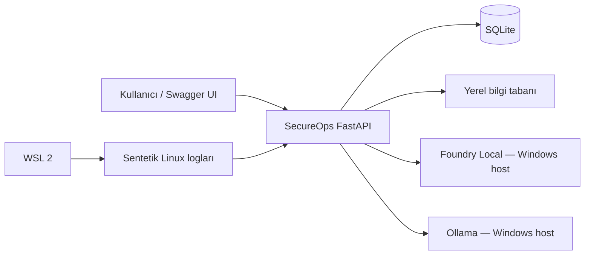
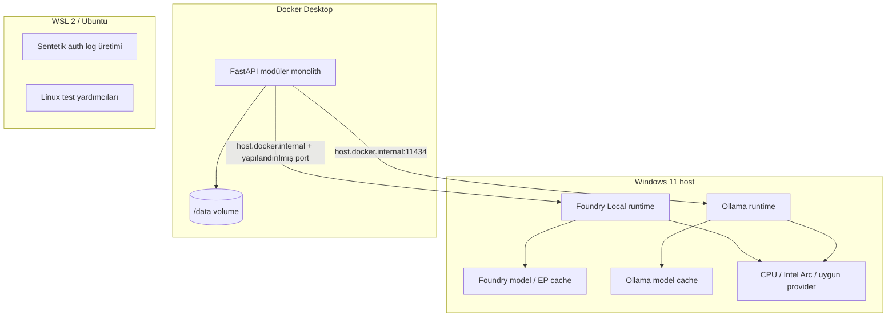
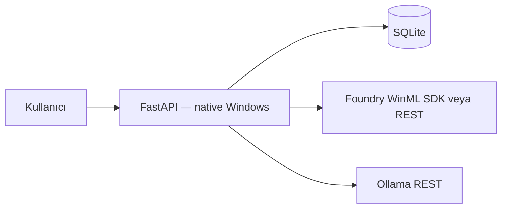
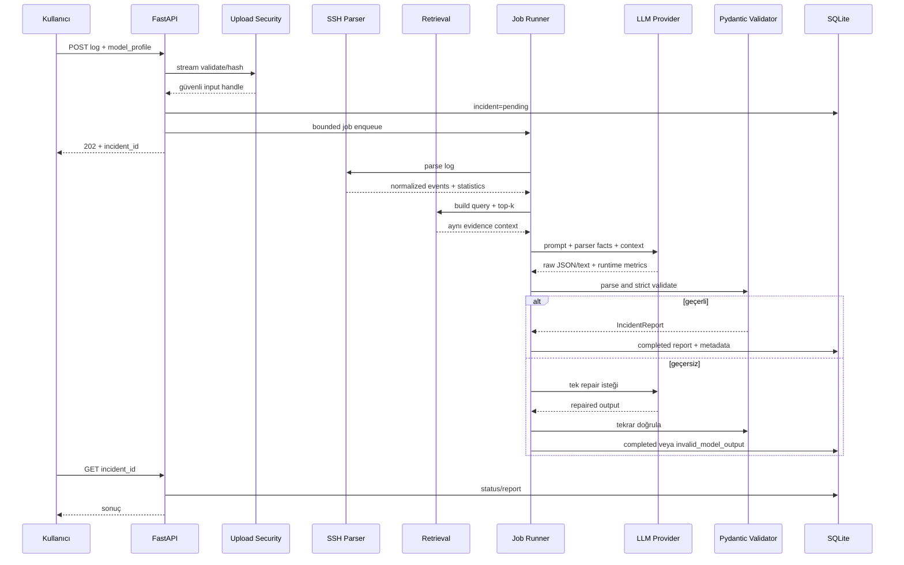

# SecureOps Local — Architecture

## 1. Mimari amaçlar

Mimari şu kalite hedeflerini dengeler:

- Hassas veriyi cihazda tutmak
- Deterministik gerçeklerle LLM yorumunu ayırmak
- Foundry Local ve Ollama arasında provider bağımsızlığı
- Dört haftada uygulanabilirlik
- Offline kullanım için paketlenebilirlik
- Test edilebilir, küçük modüller
- Gereksiz dağıtık sistem karmaşıklığından kaçınmak

Mimari yaklaşım: **modüler monolith + host üzerinde yerel inference runtime’ları**.

## 2. Sistem bağlamı



Haricî aktör yoktur. Cloud LLM veya cloud vector store mimarinin parçası değildir.

## 3. Hedef deployment topolojisi



Foundry endpoint’i dinamik olabileceği için hard-code edilmez. Host-side launcher veya ayar dosyası gerçek endpoint’i uygulamaya verir.

## 4. Native fallback topolojisi

Docker-host ağı veya Foundry endpoint binding’i güvenilir değilse:



Bu fallback başarısızlık değildir. MVP’nin güvenilir çalışmasını sağlayan belgelenmiş deployment profilidir.

## 5. Uygulama katmanları

```text
API layer
  ↓
Application services / orchestration
  ↓
Domain contracts and models
  ↓
Infrastructure adapters
  ├── SQLite repositories
  ├── TF-IDF retrieval
  ├── Foundry provider
  ├── Ollama provider
  └── file/document readers
```

Bağımlılık yönü domain’e doğrudur. Parser veya benchmark scorer FastAPI’ye bağımlı olmamalıdır.

## 6. Planlanan repository yapısı

```text
src/secureops_local/
├── api/
│   ├── app.py
│   ├── dependencies.py
│   ├── error_handlers.py
│   ├── middleware.py
│   └── routes/
├── core/
│   ├── config.py
│   ├── errors.py
│   ├── logging.py
│   └── types.py
├── domain/
│   ├── incidents.py
│   ├── knowledge.py
│   ├── models.py
│   └── benchmarks.py
├── parsers/
│   ├── base.py
│   ├── registry.py
│   └── ssh_auth.py
├── security/
│   ├── uploads.py
│   ├── redaction.py
│   └── limits.py
├── ingestion/
│   ├── readers.py
│   ├── cleaner.py
│   ├── chunker.py
│   └── service.py
├── retrieval/
│   ├── base.py
│   ├── tfidf.py
│   └── embeddings.py
├── llm/
│   ├── base.py
│   ├── foundry.py
│   ├── ollama.py
│   ├── prompts.py
│   ├── validation.py
│   └── registry.py
├── services/
│   ├── incident_analysis.py
│   ├── jobs.py
│   └── model_catalog.py
├── benchmark/
│   ├── cases.py
│   ├── runner.py
│   ├── metrics.py
│   └── scoring.py
└── db/
    ├── models.py
    ├── session.py
    └── repositories/
```

Gerçek bootstrap sırasında isimler küçük gerekçelerle değişebilir; katman sınırları korunmalıdır.

## 7. Ana analiz akışı



## 8. Domain sözleşmeleri

### 8.1 Parser

Kavramsal interface:

- `can_parse(metadata, sample) -> bool`
- `parse(stream, parse_context) -> ParseResult`
- `summarize(events, parse_context) -> ParserStatistics`
- `build_retrieval_query(statistics) -> RetrievalQuery`

`ParseResult`:

- Parser kimliği ve sürümü
- Normalize olaylar
- Deterministik findings
- Statistics
- Uyarılar/limitations
- Parse edilemeyen satır bilgisi

### 8.2 Retrieval

- `index(document_chunks) -> IndexBuildResult`
- `search(query, top_k, filters) -> list[RetrievedChunk]`
- `health() -> RetrievalHealth`

### 8.3 LocalLLMProvider

- `health() -> ProviderHealth`
- `list_models() -> list[ModelProfile]`
- `resolve_model(profile) -> ResolvedModel`
- `generate(request) -> GenerationResult`
- `generate_stream(request) -> token stream + result`
- Gerekliyse `load`/`unload`; ortak çağıran provider’a özgü olmayan kavramları kullanır.

`GenerationResult`:

- Provider/runtime kimliği
- Model alias ve resolved ID/digest
- Quantization
- Execution provider
- Raw content
- Finish reason
- Prompt/completion token sayıları
- TTFT ve total duration
- Provider’a özgü güvenli metadata

### 8.4 Repository

Repository interface’leri uygulama servisinin SQLAlchemy detayına bağımlılığını azaltır:

- DocumentRepository
- IncidentRepository
- ModelRunRepository
- BenchmarkRepository

## 9. API tasarım kararları

### `GET /health`

API liveness, DB ve iki provider’ın durumunu ayrı alanlarda döndürür. Bir provider kapalıyken API tamamen ölü sayılmaz; genel durum `degraded` olabilir. DB kullanılamıyorsa readiness başarısızdır.

### `GET /models`

Yalnızca güvenli model metadata’sı döndürür:

- Profile ID
- Provider
- Runtime version
- Model alias/resolved ID
- Quantization
- Availability/cache/load status
- Execution provider

Host path veya hassas cache yolu döndürülmez.

### `POST /v1/knowledge/ingest`

- Multipart file + source metadata
- Varsayılan 20 MiB limit
- PDF/MD/TXT
- Başarı: `201 Created`
- Aynı hash: `409 Conflict` veya idempotent mevcut belge response; bootstrap sırasında tek politika seçilir

### `POST /v1/incidents/analyze`

- Multipart SSH log
- `model_profile_id`
- Opsiyonel redaction mode
- Varsayılan 5 MiB limit
- Başarı: `202 Accepted`
- Queue dolu: `429`
- Uygun parser yok: `422`

### `GET /v1/incidents/{id}`

Durumlar:

- `pending`
- `running`
- `completed`
- `failed`
- `interrupted`
- `invalid_model_output`

### Benchmark endpoint’leri

Benchmark her zaman background job’dır. Aynı benchmark config hash’i aktifse duplicate run önlenebilir.

## 10. Job runner tasarımı

MVP’de dış queue yoktur.

Öneri:

- Bounded in-process queue
- Başlangıç concurrency: 1
- Model ve RAM baskısını önlemek için provider başına aynı anda tek inference
- Job state SQLite’ta
- Process açılırken `running` kalan job’ları `interrupted` yap
- Queue capacity yapılandırılabilir
- Graceful shutdown yeni job kabulünü durdurur

FastAPI `BackgroundTasks` tek başına job state, backpressure ve restart davranışı vermediği için ana soyutlama yapılmamalıdır.

## 11. Veritabanı tasarımı

### documents

- `id` UUID
- `title`
- `publisher`
- `source_url`
- `document_version`
- `license_id`
- `redistribution_status`
- `sha256`
- `ingested_at`

### document_chunks

- `id` UUID
- `document_id` FK
- `ordinal`
- `heading_path`
- `page_start/page_end`
- `content`
- `content_sha256`
- `word_count/token_estimate`
- Opsiyonel embedding metadata/BLOB

### incidents

- `id` UUID
- `status`
- `input_sha256`
- `input_size_bytes`
- `parser_id/version`
- `parser_statistics_json`
- `report_json`
- `error_code`
- `raw_log_retained=false`
- Timestamps

### incident_findings

- `incident_id` FK
- `finding_type`
- `structured_value_json`
- `evidence_reference_json`
- Gerekirse maskelenmiş snippet

### model_runs

- `incident_id` FK nullable
- Provider/runtime/model/quantization/execution metadata
- Prompt/schema/retrieval version
- Generation settings
- Timing/token/RAM metrics
- Schema validation durumu
- Repair count

### benchmark_runs / benchmark_results

- Config hash
- Case/profile/repetition ilişkisi
- Status/progress
- Deterministic quality scores
- Manual review fields

SQLite ayarları:

- Foreign keys ON
- WAL mode
- Busy timeout
- Açık transaction sınırları
- Index: status, created_at, sha256, provider/profile, benchmark FKs

## 12. Parser iç mimarisi

İki aşamalı yaklaşım:

1. Satır → normalize authentication event
2. Event list/stream → aggregate statistics ve findings

Normalize event alanları:

- Event type
- Timestamp + timezone confidence
- Host
- Process/PID
- Username
- Source address
- Source port
- Auth method
- Success/failure
- Privileged target flag
- Invalid user flag
- Source line reference/hash

Aggregation parser regex’lerinden ayrı tutulur. Böylece olay parsing ve güvenlik örüntüsü kuralları bağımsız test edilir.

## 13. Retrieval mimarisi

SQLite belge/chunk truth store’dur. TF-IDF indeksi küçük bilgi tabanı için process başlangıcında veya ilk sorguda yeniden oluşturulabilir.

MVP’de pickle ile güvenilmeyen indeks yüklenmez. Persist gerekiyorsa güvenli JSON/NumPy formatı ve hash doğrulaması kullanılır.

Embedding etkinleşirse:

- Vektörler SQLite BLOB olarak saklanır.
- Dtype, dimension, model ID ve normalization metadata zorunludur.
- Arama NumPy ile yapılır.
- Index küçük olduğu için haricî vector DB gerekmez.

## 14. Prompt mimarisi

Prompt bölümleri:

1. System policy
2. Output schema özeti
3. Parser facts — trusted structured data
4. Retrieved documents — untrusted reference data
5. Limited log evidence — untrusted data
6. Task instruction

Her bölüm açık delimiters ve rol tanımı kullanır. Retrieved dokümanda “önceki talimatları yok say” yazması instruction olarak değerlendirilmez.

## 15. Model profile konfigürasyonu

Model adı kod içine dağılmaz. Konfigürasyon örneği kavramsal olarak şunları taşır:

- `profile_id`
- `provider`
- `model_name`
- `endpoint`
- `quantization`
- `temperature`
- `top_p`
- `seed`
- `max_output_tokens`
- `context_limit`
- `timeout_seconds`
- `keep_alive/ttl`

Secret gerekmeyen local API anahtar placeholder’ları loglanmamalıdır.

## 16. Hata modeli

Domain hata kodları HTTP’den ayrıdır:

- `upload_too_large`
- `unsupported_media_type`
- `unsafe_or_invalid_file`
- `unsupported_log_format`
- `parse_failed`
- `knowledge_base_empty`
- `retrieval_failed`
- `provider_unavailable`
- `model_not_available`
- `inference_timeout`
- `invalid_model_output`
- `queue_full`
- `job_interrupted`

API katmanı bunları kontrollü HTTP status ve güvenli mesajlara eşler.

## 17. Offline mimarisi

Offline bundle manifesti şunları listeler:

- Uygulama commit SHA
- Python sürümü
- Kilitli wheel dosyaları ve hash’leri
- Docker image digest veya native kurulum paketi
- Foundry runtime/SDK sürümü
- Foundry model ID ve cache doğrulaması
- Ollama sürümü
- Ollama model digest
- Knowledge source hash’leri ve lisansları
- DB migration head
- Prompt/schema sürümü

Offline mod, dış ağ çağrısı yapan fallback içeremez. Cache eksikse açık preflight hatası verir.

## 18. Mimari kalite kapıları

- Provider contract fake implementasyonla test edilebilir olmalı.
- Parser hiçbir runtime’a bağımlı olmamalı.
- Retrieval aynı evidence paketini iki modele verebilmeli.
- DB olmadan saf unit testler mümkün olmalı.
- API testi gerçek LLM indirmemeli.
- Offline test ayrı, açık marker’lı olmalı.

